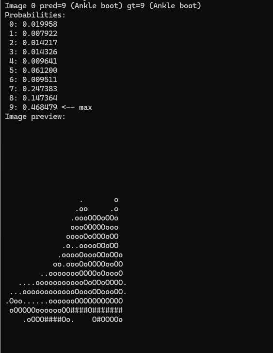
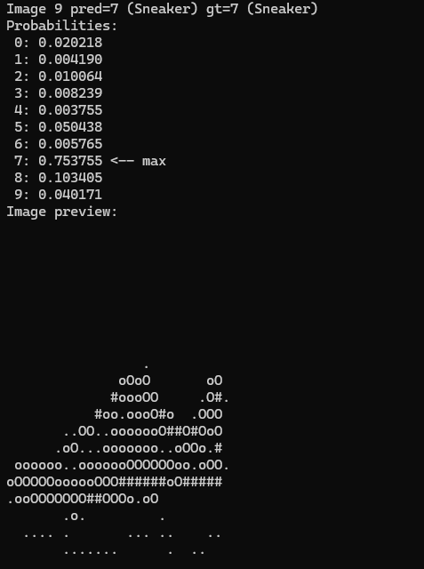
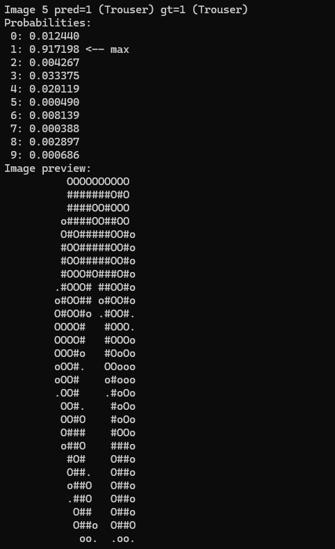

# Mini CNN Framework (C++)

Minimal Convolutional Neural Network (CNN) inference framework implemented in C++ from scratch.
Supports Conv2D, ReLU, MaxPool, Linear, Flatten, and Softmax layers, with LeNet inference on MNIST and Fashion-MNIST.

---

## Highlights

* C++17 implementation
* Custom Tensor data structure
* Modular neural network layers
* Baseline direct convolution
* Optimized im2col convolution (performance branch)
* MNIST / LeNet inference
* Clean Git history showing development and optimization steps

---

## Branches

* `master` – baseline implementation
* `performance` – optimized implementation (im2col)

---

## Build

```bash
make
```

---

## Run

```bash
./lenet --mnist
./lenet --fashion
```

Optional:

```bash
./lenet --mnist --show
./lenet --fashion --show
```

---

## Results

| Dataset       | Accuracy |
| ------------- | -------- |
| MNIST         | 0.9839   |
| Fashion-MNIST | 0.8450   |

---
---

## Performance Optimization (Task 2)

The `performance` branch implements an optimized convolution using the **im2col** technique.

Instead of performing direct convolution with nested loops, the input tensor is transformed into a matrix representation, allowing more efficient computation.
aseline (master branch):
- Conv2d forward implemented as direct convolution with nested loops over:
  N, out_channels, out_h/out_w, in_channels, kernel_h/kernel_w.
- This is simple but has poor cache locality and repeated memory accesses.

## Optimization (performance branch):
- Replaced direct Conv2d with an im2col-based approach:
  1) For each input image, unfold each KxK receptive field into a column matrix (im2col).
     Shape: (C*K*K) x (out_h*out_w)
  2) Compute convolution as a GEMM-like operation:
     Y = W * col + bias
     where W has shape (out_channels) x (C*K*K)
  3) Reshape the result back to (N, out_channels, out_h, out_w)

## Correctness:
- The network architecture and weight-loading remain identical to master.
- Accuracy remains consistent with the expected pretrained LeNet weights:
  MNIST ~0.98 and Fashion-MNIST ~0.86 (depending on dataset selection and padding).

## Timing setup:
- Measured end-to-end runtime for 10k test images using:
  /usr/bin/time -f "%e s" ./lenet --mnist  > /dev/null
  /usr/bin/time -f "%e s" ./lenet --fashion > /dev/null
- Each configuration was executed 5 times.

## Results (5 runs, seconds):

MASTER MNIST:
- 6.89, 6.76, 6.87, 6.97, 6.94
Average ≈ 6.89 s

MASTER Fashion-MNIST:
- 6.93, 6.92, 6.85, 6.80, 6.88
Average ≈ 6.88 s

PERFORMANCE (im2col) MNIST:
- 2.59, 2.60, 2.64, 2.62, 2.61
Average ≈ 2.61 s

PERFORMANCE (im2col) Fashion-MNIST:
- 2.63, 2.61, 2.57, 2.53, 2.49
Average ≈ 2.57 s

Speedup (using averages):
- MNIST:   6.89 / 2.61 ≈ 2.64x faster
- Fashion: 6.88 / 2.57 ≈ 2.68x faster

Notes:
- The goal of Task 2 is to use an alternative algorithm (im2col) with correct results.
- Performance can vary depending on CPU, compiler flags, and memory/cache behavior.

### Improvements

- Reduced runtime compared to baseline direct convolution
- Better cache utilization
- More efficient computation for repeated inference

This demonstrates a transition from a correctness-focused implementation (Task 1) to a performance-optimized system (Task 2), which is critical in edge AI and real-time systems.

---
## Example Predictions

### MNIST


---

### Fashion-MNIST





---

## Observations

* High accuracy on MNIST (~98%) confirms correct implementation of LeNet
* Lower accuracy on Fashion-MNIST (~84%) due to higher dataset complexity
* Model shows strong confidence for correct predictions
* Performance differences highlight generalization challenges

---

## Acknowledgement

This project was developed as part of the course
**"Systems Engineering and Architecting for Edge Computing"**
at Technische Hochschule Ingolstadt.

The initial project skeleton was provided by the course instructor.

---

