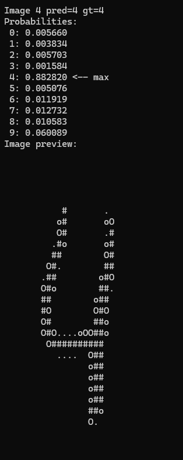
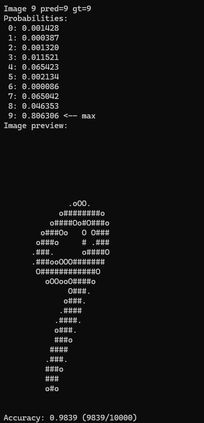
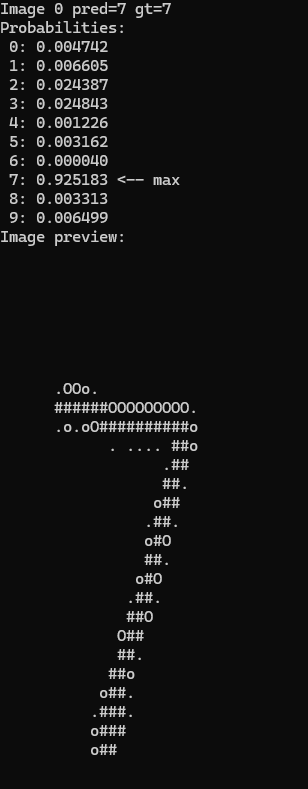

# Mini CNN Framework

Minimal CNN inference framework implemented in C++ from scratch.  
Supports Conv2D, ReLU, MaxPool, Linear, Flatten, and Softmax layers, with LeNet inference on MNIST.

## Highlights
- C++17 implementation
- Modular neural network layers
- Baseline direct convolution
- Optimized im2col convolution in the `performance` branch
- MNIST / LeNet inference
- Clean Git history showing development and optimization steps

## Branches
- `master` — baseline implementation
- `performance` — optimized implementation

## Build
```bash
make
## Example Predictions

### MNIST





### Fashion-MNIST


## Results

| Dataset        | Accuracy |
|----------------|----------|
| MNIST          | 0.9839   |
| Fashion-MNIST  | 0.8450   |

## Acknowledgement

This project was developed as part of the course
"Systems Engineering and Architecting for Edge Computing"
An der Technischen Hochschule Ingolstadt.

The course instructor provided the initial project skeleton.
